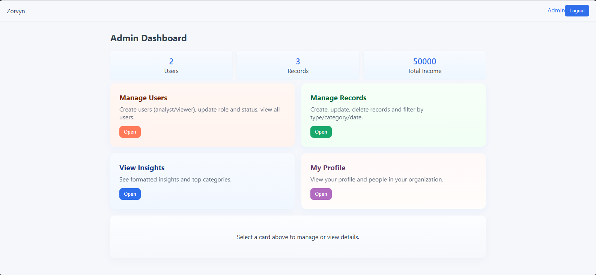
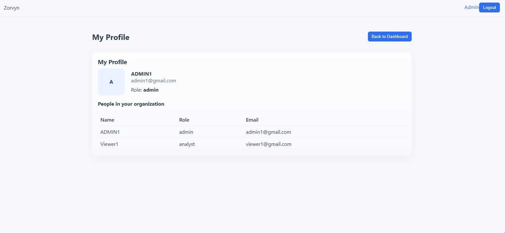
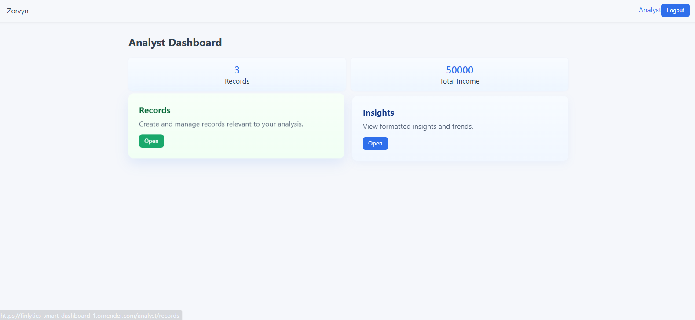
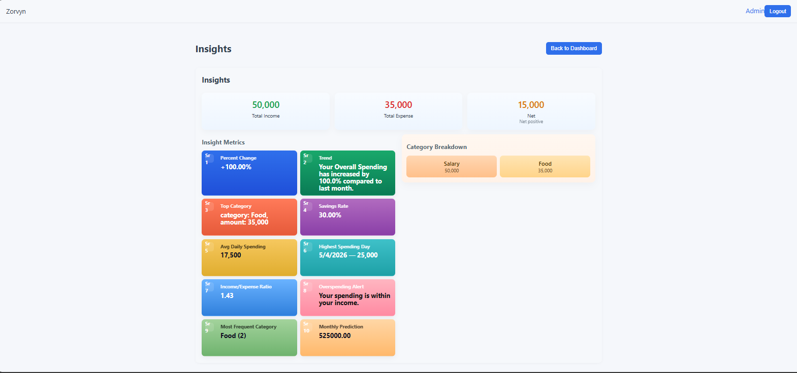
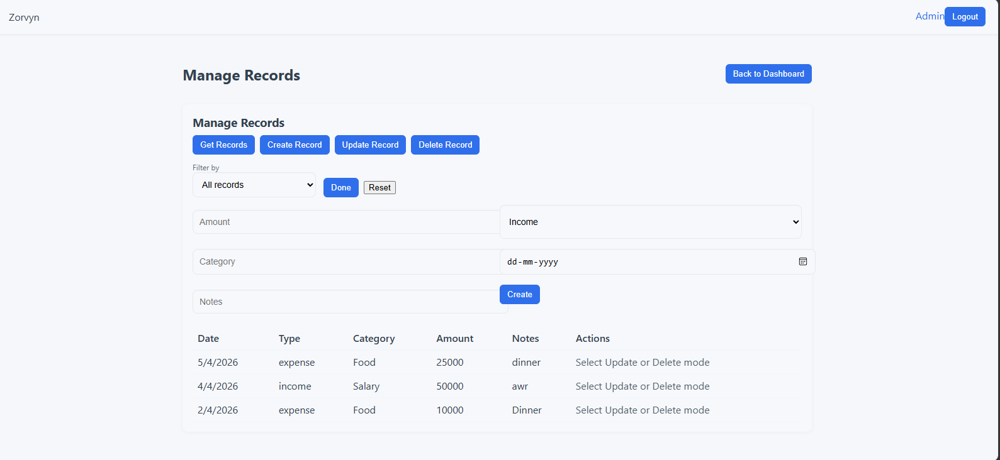
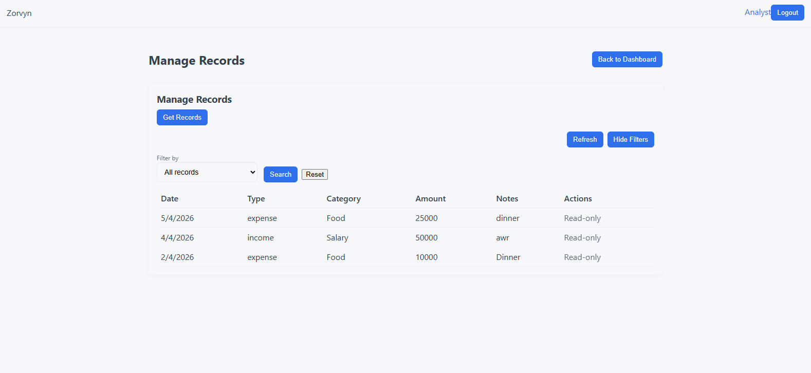
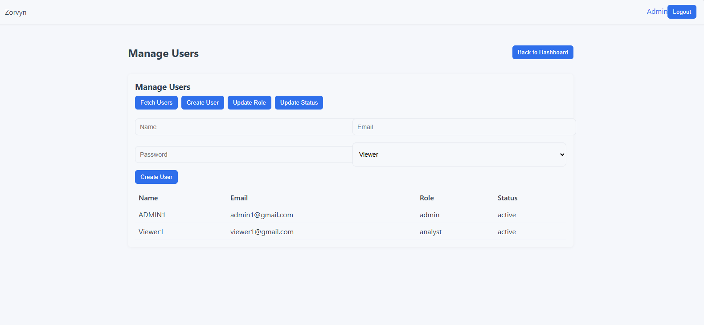
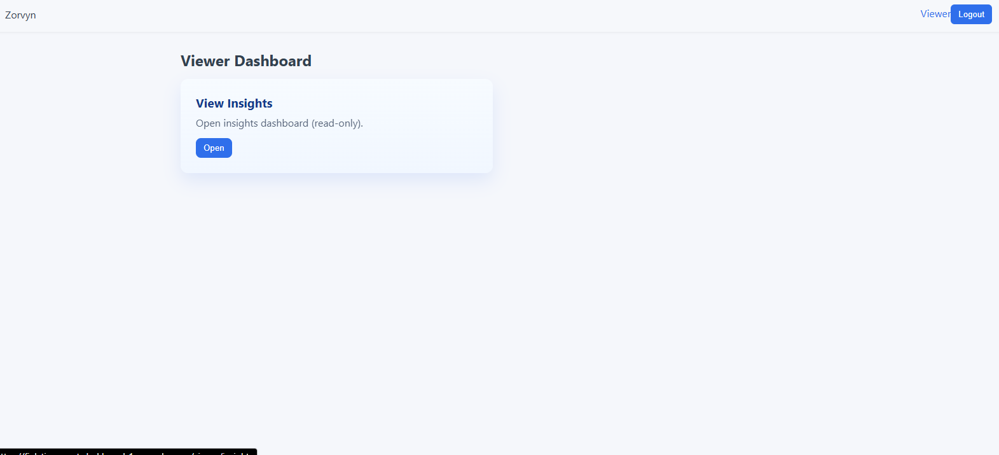

# 🚀 Finlytics – Organization-Based Smart Finance Dashboard (Backend)

## 📌 Overview

**Finlytics** is a backend-driven finance management system designed for organizations to manage and analyze financial data efficiently. It supports **role-based access control (RBAC)**, enabling different users within an organization to interact with financial records based on their permissions.

The system goes beyond basic CRUD operations by providing **analytics, trends, and smart insights** to help organizations understand their financial behavior.

---

## 🎯 Objectives

* Build a scalable backend system for managing financial data
* Implement secure **role-based access control**
* Provide **analytical dashboard APIs**
* Demonstrate strong backend design and logical thinking

---

## 🏢 Organization-Based Architecture

Each user belongs to an **organization**, and all financial records are associated with that organization.

### Key Entities:

* **Organization**
* **User**
* **Financial Record**

---

## 👥 User Roles & Permissions

### 👁️ Viewer

* View dashboard summaries
* View financial records (read-only)
* Apply filters (date, category, type)

---

### 📊 Analyst

* View all financial records
* Access analytics and insights
* Analyze trends and category breakdowns

---

### 🛠️ Admin

* Full system control
* Create/update/delete records
* Manage users (create, update roles, deactivate)
* Access all analytics

---

## 💰 Financial Records

Each financial record contains:

* Amount
* Type (Income / Expense)
* Category (e.g., Food, Travel, Rent)
* Date
* Notes / Description
* Organization ID
* Created By

---

## 🔧 Features Implemented

### ✅ 1. User & Role Management

* User registration and login
* Assign roles (Viewer, Analyst, Admin)
* Activate/deactivate users
* Organization-based user grouping

---

### ✅ 2. Financial Records Management

* Create, read, update, delete records
* Filter records by:

  * Date range
  * Category
  * Type
* Soft delete support (optional)

---

### ✅ 3. Dashboard Summary APIs

#### 📊 Basic Metrics:

* Total income
* Total expenses
* Net balance

#### 📈 Advanced Analytics:

* Monthly trends
* Weekly trends
* Category-wise totals
* Recent transactions

---

### ✅ 4. Smart Insights (No AI, Logic-Based)

* “You spent 35% more than last month”
* “Food is your highest expense category”
* “Expenses increased over the last 3 months”
* “Unusual high spending detected”

---

### ✅ 5. Access Control (RBAC)

* Middleware-based authorization
* Role-specific API access
* Secure route protection

---

### ✅ 6. Validation & Error Handling

* Input validation for all APIs
* Proper HTTP status codes
* Meaningful error messages
* Protection against invalid operations

---

### ✅ 7. Data Persistence

* Database: MongoDB
* Structured schema for users, organizations, and records

---

## ⚡ Optional Enhancements (Implemented / Planned)

* JWT Authentication
* Search functionality
* Sorting (date, amount)
* API Deployment (Render)
* Unit testing (Jest)

---

## 🏗️ Tech Stack

* **Backend:** Node.js, Express.js
* **Database:** MongoDB
* **Authentication:** JWT
* **Architecture:** MVC (Controller-Service-Model)

---

## 📂 Project Structure

```
Zorvy/
│
├── backend/
│ ├── src/
│ │ ├── config/ # Database connection
│ │ ├── controllers/ # Route controllers (auth, users, records, dashboard)
│ │ ├── middleware/ # Auth, role-based access, error handling
│ │ ├── models/ # Mongoose schemas (User, Record, Organization)
│ │ ├── routes/ # API routes
│ │ ├── services/ # Business logic layer
│ │ ├── utils/ # Helper functions & insights calculations
│ │ └── app.js # Express app setup
│ │
│ ├── server.js # Entry point
│ ├── .env # Environment variables (not pushed)
│ ├── package.json
│
├── frontend/
│ ├── src/
│ │ ├── components/ # Reusable UI components
│ │ ├── pages/ # Role-based pages (Admin, Analyst, Viewer)
│ │ ├── services/ # API calls (auth, records, users)
│ │ ├── App.jsx # Main app component
│ │ ├── main.jsx # Entry point
│ │ └── styles.css # Global styles
│ │
│ ├── public/ # Static assets
│ ├── index.html
│ ├── .env # Frontend env variables
│ ├── package.json
│
├── README.md # Project documentation
└── .gitignore
```

---

## 🔌 API Endpoints

### 🔐 Auth

* POST /auth/register
* POST /auth/login

---

### 👤 Users

* GET /users
* PATCH /users/:id/role
* PATCH /users/:id/status

---

### 💰 Records

* POST /records
* GET /records
* PUT /records/:id
* DELETE /records/:id

---

### 📊 Dashboard

* GET /dashboard/summary
* GET /dashboard/trends
* GET /dashboard/category-breakdown
* GET /dashboard/insights

---

## 🧠 Key Design Decisions

* Used **role-based middleware** for access control
* Implemented **aggregation queries** for analytics
* Designed system to support **multi-user organizations**
* Separated logic into **service layer for scalability**

---

## 🚀 Future Improvements

* AI-based expense categorization
* Predictive analytics
* Real-time notifications
* Multi-organization support per user

---
## ScreenShots

[text](ReadMe.md)         

---

## 📌 Conclusion

This project demonstrates:

* Strong backend architecture
* Real-world financial system design
* Secure role-based access control
* Data-driven insights without unnecessary complexity

---

⭐ If you found this project useful, feel free to star the repository!
